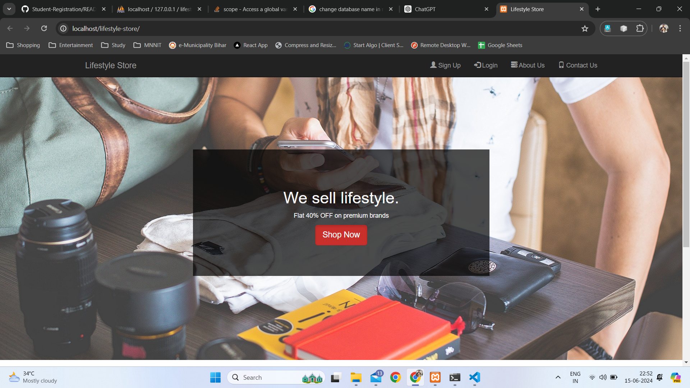
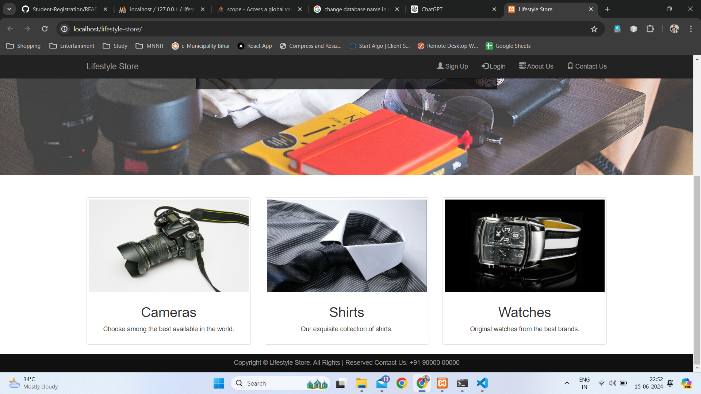
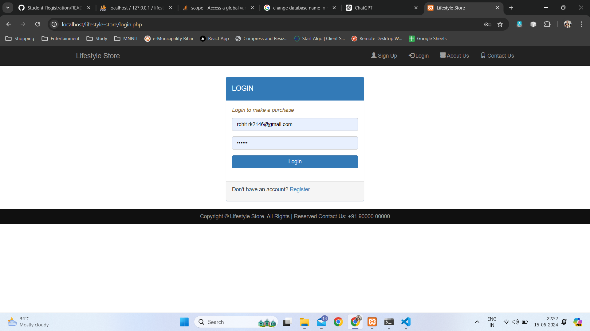
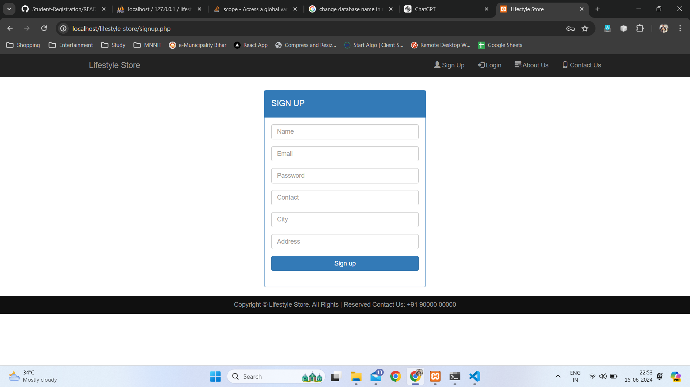
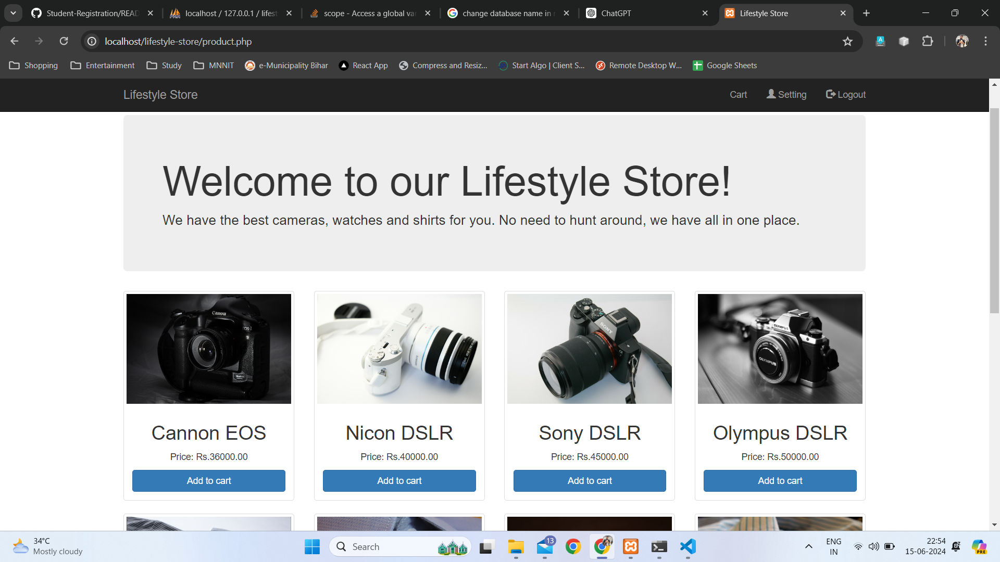
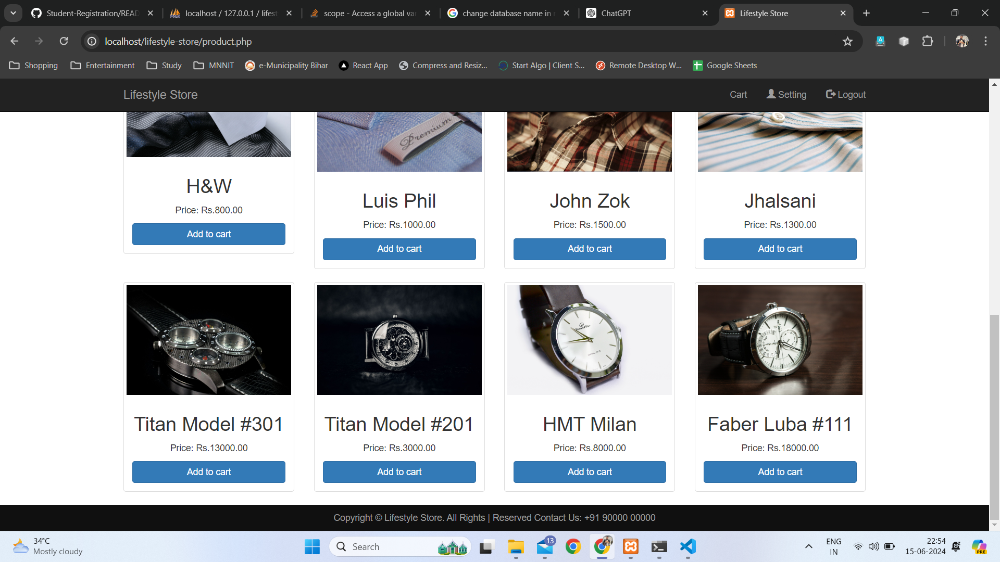
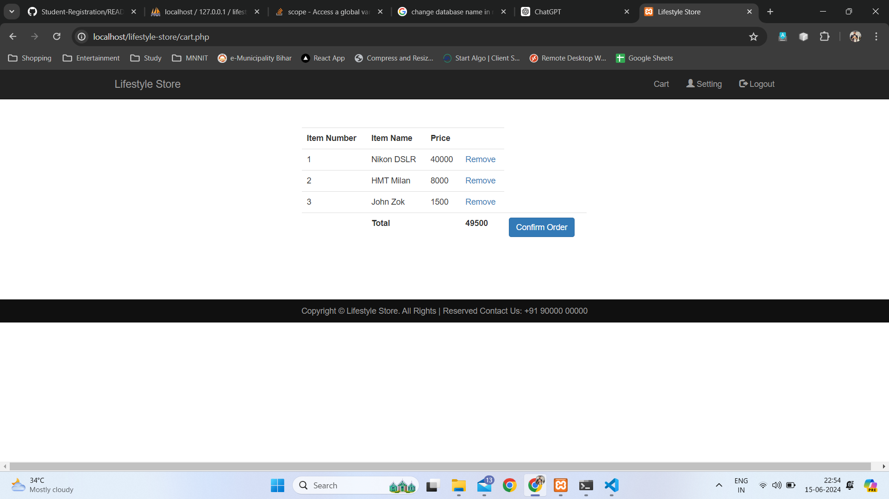
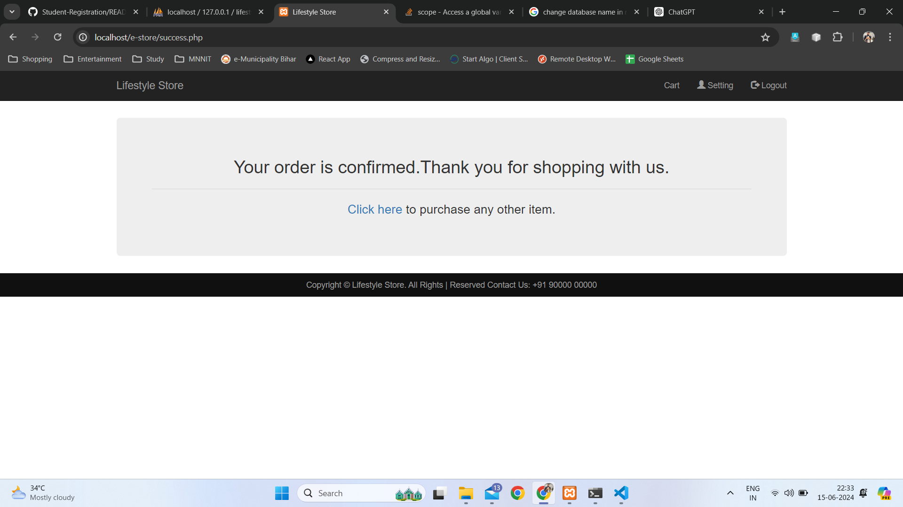
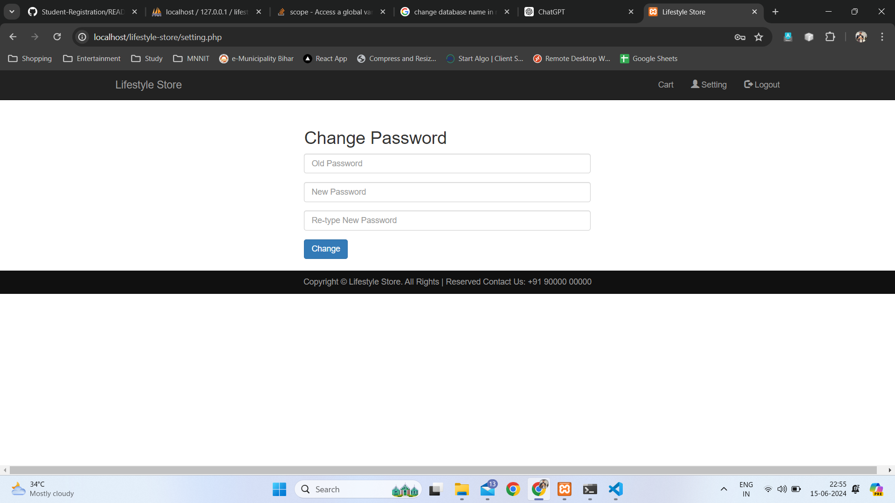

# Lifestyle Store

Lifestyle Store is an e-commerce website for selling cameras, shirts, and watches. Users can log in, sign up, view products, add them to their cart, and checkout from the cart. This project is built using PHP and MySQL.

## Table of Contents

- [Features](#features)
- [Demo](#demo)
- [Installation](#installation)
- [Usage](#usage)
- [Project Structure](#project-structure)
- [Technologies Used](#technologies-used)
- [Contributing](#contributing)
- [License](#license)
- [Contact](#contact)
- [Screenshots](#screenshots)

## Features

- User authentication (login/signup)
- Change password
- Product listing
- Add products to cart
- Remove products from cart
- Checkout process
- Responsive design

## Demo

You can check out the live demo of the project [here](#).

## Installation

Follow these steps to set up the project locally:

1. **Clone the repository:**

    ```bash
    git clone https://github.com/rohit-kumar-india/lifestyle-store.git
    cd lifestyle-store
    ```

2. **Setup the database:**

    - Create a MySQL database.
    - Import the `lifestyle_store.sql` file located in the `sql` directory into your database.

3. **Configure the project:**

    - Update the database configuration in `common.php` located in the `include` directory:

    ```php
    <?php
    $host = "localhost";
    $username = "your_username";
    $password = "your_password";
    $database = 'lifestyle_store';
    ?>
    ```

4. **Start the server:**

    - Ensure you have a local server running (e.g., XAMPP, WAMP, MAMP).
    - Place the project files in the `htdocs` directory (for XAMPP) or the respective directory for your server.

## Usage

- Open your web browser and go to `http://localhost/lifestyle-store`.
- You can now sign up as a new user or log in with existing credentials.
- Browse products, add them to your cart, and proceed to checkout.

## Project Structure

lifestyle-store/
│
├── bootstrap/
├── css/
├── img/
│
├── includes/
│ ├── check_if_added.php
│ ├── header.php
│ ├── footer.php
│ └── common.php
│
├── sql/
│ └── database.sql
│
├── index.php
├── login.php
├── login_submit.php
├── signup.php
├── signup_script.php
├── cart.php
├── logout.php
├── product.php
└── README.md


## Technologies Used

- **Front-end:**
  - HTML
  - CSS
  - bootstrap

- **Back-end:**
  - PHP
  - MySQL

## Contributing

Contributions are welcome! Please follow these steps to contribute:

1. Fork the repository.
2. Create a new branch (`git checkout -b feature-branch`).
3. Make your changes.
4. Commit your changes (`git commit -m 'Add new feature'`).
5. Push to the branch (`git push origin feature-branch`).
6. Open a pull request.

## License

This project is licensed under the MIT License. See the [LICENSE](LICENSE) file for details.

## Contact

For any inquiries or issues, please contact:

- **Name:** Rohit Kumar
- **Email:** rohit.rk2146@gmail.com
- **GitHub:** [yourusername](https://github.com/rohit-kumar-india)

## Screenshots


 
 
 
 
 
 
 
 